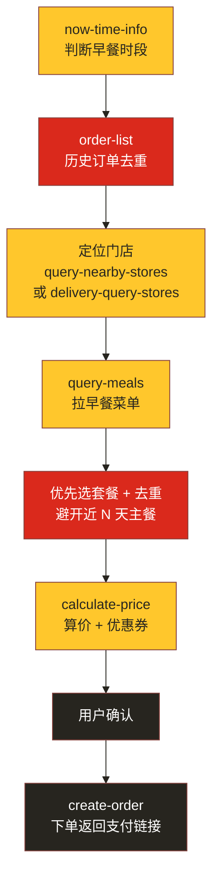

# MCP 集成说明

本项目基于**麦当劳 MCP Server（mcd-mcp）** 开发，完整复用其点单链路能力。本文件说明实际使用的 MCP Server、Tool、调用流程与业务价值。

## 一、使用的 MCP Server

| 项目 | 值 |
|---|---|
| Server 名称 | `mcd-mcp` |
| 类型 | `streamablehttp` |
| 地址 | `https://mcp.mcd.cn` |
| 鉴权 | HTTP Header `Authorization: Bearer <YOUR_MCP_TOKEN>` |

> ⚠️ Token 为个人申请的 MCP Token，仅用环境变量 / 占位符表示，**不写入本仓库任何文件**。

配置示例（请将 `YOUR_MCP_TOKEN` 替换为自己的 Token）：

```json
{
  "mcpServers": {
    "mcd-mcp": {
      "type": "streamablehttp",
      "url": "https://mcp.mcd.cn",
      "headers": {
        "Authorization": "Bearer YOUR_MCP_TOKEN"
      }
    }
  }
}
```

## 二、使用的 Tool 清单

| Tool | 用途 | 在本 skill 中的角色 |
|---|---|---|
| `now-time-info` | 获取当前时间 | 判断今天星期几、是否仍在早餐供应时段 |
| `order-list` | 查询历史订单 | **去重核心**：提取最近 N 天点过的主餐，组成"已点清单" |
| `query-nearby-stores` | 查询到店可点餐门店 | 到店自取场景定位门店（storeCode） |
| `delivery-query-addresses` | 查询配送地址列表 | 麦乐送场景选择配送地址 |
| `delivery-query-stores` | 查询地址可配送门店 | 麦乐送场景定位门店（storeCode + beCode） |
| `query-meals` | 查询餐品列表 | 拉取门店早餐菜单，筛选早餐套餐 |
| `query-store-coupons` / `query-my-coupons` | 查询优惠券 | 为订单匹配可用早餐券 |
| `calculate-price` | 计算价格（含优惠） | 算出所选套餐最终价格（单位分，展示 ÷100） |
| `create-order` | 创建订单 | 用户确认后下单，返回支付链接 |

## 三、调用流程



关键参数配对规则（遵守 MCP 约束，否则接口报错）：

- 到店自取：`orderType=1` + `beType=1` + 不传 `beCode`
- 得来速：`orderType=1` + `beType=5` + 必传 `beCode`
- 麦乐送：`orderType=2` + `beType=2` + 必传 `beCode`

## 四、业务价值

1. **解决真实痛点**：用户每天早上纠结"吃什么"，且容易连续几天点同一份。本 skill 用历史订单去重，自动换花样。
2. **提升下单效率**：一句口令完成"选店 → 选餐 → 算价 → 下单"全链路，无需在 App 里逐级点选。
3. **优先套餐 + 用券**：默认选含主餐+饮品的早餐套餐并匹配可用优惠券，兼顾营养搭配与省钱。
4. **安全可控**：下单前必须用户确认，支付环节由用户在麦当劳 App 完成，skill 不代付、不碰资金。

## 五、信息安全

- 本仓库不包含任何真实 Token、密钥、账号凭证。
- MCP 配置中的 Token 一律以 `YOUR_MCP_TOKEN` 占位符表示，由使用者自行申请填入。
