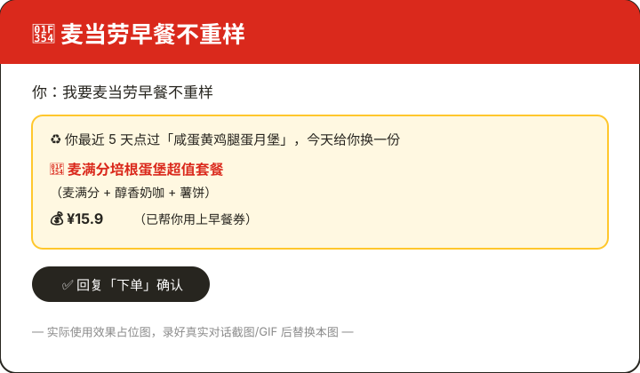

<div align="center">

# 🍔 麦当劳早餐不重样 · McD Breakfast Variety

### 一句口令，天天换花样。再也不用纠结"早上吃麦当劳点啥"

**说一句「我要麦当劳早餐不重样」，它查你的历史订单、自动避开最近吃过的，挑一份不重复的早餐套餐，算好价、带上优惠券，一键下单。**

<br/>


<br/>

> 💛 觉得有用的话，点个 **⭐ Star** 支持一下！这是麦当劳程序员节创意开发大赛参赛作品，Star 越多排名越靠前。

</div>

---

## 😩 你有没有过这种早晨

- 闹钟响了，脑子还没醒，就得决定"早餐吃啥"
- 打开麦当劳 App，一层层点进去，纠结半天
- 回过神发现——这周已经第四天点**同一个套餐**了

**这个 Skill 就是来解决这件小事的。** 它记得你最近吃过什么，每天帮你换着来。

```text
你：我要麦当劳早餐不重样
它：你最近 5 天点过「咸蛋黄鸡腿蛋月堡」，今天给你换一份 👇
    🍔 麦满分培根蛋堡超值套餐（麦满分 + 醇香奶咖 + 薯饼）
    💰 ¥15.9（已帮你用上早餐券）
    确认就回「下单」
你：下单
它：订单好了，这是支付链接 🔗
```

---

## ✨ 为什么好用

| | 功能 | 说明 |
|---|---|---|
| ♻️ | **自动不重样** | 查历史订单去重，避开最近 N 天点过的主餐，天天换花样 |
| 🍔 | **优先选套餐** | 默认挑含主餐+饮品的早餐套餐，营养搭配不将就 |
| 🎟️ | **自动用券** | 下单前匹配可用早餐优惠券，能省则省 |
| ⏰ | **懂早餐时段** | 自动判断是否还在供应时段，过点了问你要不要预约明早 |
| 🏪 | **到店 / 外送都行** | 支持到店自取和麦乐送到家 |
| ✅ | **下单前先确认** | 展示组合和价格，你点头才真下单，不乱扣钱 |

---

## 🎬 使用效果演示

> 📸 演示截图 / GIF 占位 —— 实际运行效果

<div align="center">

<!-- 把录制好的演示 GIF 或截图放到 images/ 目录，并替换下面的路径 -->



<em>（上图为占位，录好实际对话截图/GIF 后替换 <code>images/</code> 下的图片即可）</em>

</div>

---

## 🚀 快速开始

本项目是一个基于麦当劳 MCP 的 Skill，运行在支持 MCP 的 AI 客户端中（如 Kiro、WorkBuddy 等）。

### 1️⃣ 申请麦当劳 MCP Token

参考 [麦当劳 MCP Server 使用指南](https://github.com/M-China/mcd-mcp-server) 登录并申请 MCP Token。

### 2️⃣ 配置 mcd-mcp MCP Server

在你的 AI 客户端 MCP 配置中加入（把 `YOUR_MCP_TOKEN` 换成你申请到的 Token）：

```json
{
  "mcpServers": {
    "mcd-mcp": {
      "type": "streamablehttp",
      "url": "https://mcp.mcd.cn",
      "headers": {
        "Authorization": "Bearer YOUR_MCP_TOKEN"
      }
    }
  }
}
```

### 3️⃣ 安装 Skill

把本仓库的 `skills/mcd-breakfast-variety/SKILL.md` 放进你的 AI 客户端 skills 目录（例如 Kiro 的 `.kiro/skills/mcd-breakfast-variety/SKILL.md`），客户端会自动识别。

详细的 MCP 工具与调用流程见 [`MCP_INTEGRATION.md`](MCP_INTEGRATION.md)。

---

## 🗣️ 怎么用

安装好后，在对话框里直接说口令：

```text
我要麦当劳早餐不重样
```

想更精准？带上参数：

```text
我要麦当劳早餐不重样 到店        # 到店自取
我要麦当劳早餐不重样 外送        # 麦乐送到家
我要麦当劳早餐不重样 预算20      # 控制预算（元）
我要麦当劳早餐不重样 清淡        # 口味 / 偏好（清淡 / 管饱 / 要咖啡 / 不要油炸…）
```

---

## 🧠 它是怎么做到"不重样"的

```mermaid
%%{init: {'theme': 'base', 'themeVariables': {'primaryColor': '#DA291C', 'primaryTextColor': '#fff', 'secondaryColor': '#FFC72C', 'tertiaryColor': '#27251F', 'lineColor': '#27251F'}}}%%
flowchart LR
    A["⏰ 判断早餐时段<br/>now-time-info"] --> B["♻️ 历史订单去重<br/>order-list"]
    B --> C["🏪 定位门店<br/>到店 / 外送"]
    C --> D["📋 拉早餐菜单<br/>query-meals"]
    D --> E["🍔 优先选套餐+去重<br/>避开近N天主餐"]
    E --> F["💰 算价+用券<br/>calculate-price"]
    F --> G["🔗 下单返回支付链接<br/>create-order"]
    style A fill:#FFC72C,color:#27251F
    style B fill:#DA291C,color:#fff
    style C fill:#FFC72C,color:#27251F
    style D fill:#FFC72C,color:#27251F
    style E fill:#DA291C,color:#fff
    style F fill:#FFC72C,color:#27251F
    style G fill:#27251F,color:#fff
```



核心是第 2 步：**查历史订单做去重**。它看你最近 N 天（默认 5 天）点过哪些主餐，把这些排除掉再从早餐菜单里挑——所以每天给你的都不一样。

完整 7 步链路见 [`skills/mcd-breakfast-variety/SKILL.md`](skills/mcd-breakfast-variety/SKILL.md)。

---

## 👥 适合谁用

- 🧑‍💻 每天吃麦当劳早餐、懒得想吃什么的上班族 / 学生
- 🔁 容易连续几天点同一份、想换花样的"麦门信徒"
- ⚡ 想一句话搞定"选店 → 选餐 → 算价 → 下单"的效率党
- 🛠️ 已申请麦当劳 MCP Token、在用支持 MCP 的 AI 助手的开发者

---

## 🔒 信息安全

本仓库仅包含 Skill 定义，**不含任何真实 Token、密钥或账号凭证**，MCP 配置中的 Token 一律以 `YOUR_MCP_TOKEN` 占位符表示。详见 [`CONTEST_DECLARATION.md`](CONTEST_DECLARATION.md)。

---

<div align="center">

### 如果这个 Skill 让你的早晨省了心，点个 ⭐ Star 吧！

**本项目为麦当劳程序员节创意开发大赛参赛作品，由参赛者独立开发，非麦当劳官方产品。**

餐品信息、价格及供应状态以麦当劳官方渠道的实时结果为准。

</div>
