# McD Breakfast Variety Skill · 麦当劳早餐不重样

## 一、目的

每天早上懒得想吃什么、又不想连着几天吃同一份早餐。本 skill 通过 `mcd-mcp` 查询用户的**历史订单**，自动避开最近吃过的早餐组合，从当前门店的**早餐时段菜单**里挑一份"不重样"的组合，算好价（含可用优惠券），一键下单，返回支付链接。

```mermaid
%%{init: {'theme': 'base', 'themeVariables': {'primaryColor': '#DA291C', 'primaryTextColor': '#fff', 'secondaryColor': '#FFC72C', 'tertiaryColor': '#27251F', 'lineColor': '#27251F'}}}%%
flowchart LR
    A["获取当前时间<br/>now-time-info"] --> B["查历史订单<br/>order-list 去重"]
    B --> C["定位门店<br/>到店/外送"]
    C --> D["拉早餐菜单<br/>query-meals"]
    D --> E["优先选套餐+去重<br/>避开近N天主餐"]
    E --> F["算价+优惠券<br/>calculate-price"]
    F --> G["下单返回支付链接<br/>create-order"]
    style A fill:#FFC72C,color:#27251F
    style B fill:#DA291C,color:#fff
    style C fill:#FFC72C,color:#27251F
    style D fill:#FFC72C,color:#27251F
    style E fill:#DA291C,color:#fff
    style F fill:#FFC72C,color:#27251F
    style G fill:#27251F,color:#fff
```



## 二、触发命令

### 主命令

```text
我要麦当劳早餐不重样
```

### 可带参数的变体

```text
我要麦当劳早餐不重样 到店          # 指定到店自取
我要麦当劳早餐不重样 外送          # 指定麦乐送到家
我要麦当劳早餐不重样 预算20        # 控制预算（元）
我要麦当劳早餐不重样 清淡          # 口味/偏好提示（清淡/管饱/要咖啡/不要油炸等）
```

未带参数时，默认按 **到店自取** 处理，并在挑选后向用户确认。

## 三、执行流程

### Step 0 · 识别口令与偏好

- 收到"我要麦当劳早餐不重样"即触发本 skill。
- 解析可选参数：取餐方式（到店/外送）、预算、口味偏好。缺省则先走默认、后确认。

### Step 1 · 获取当前时间

调用 `now-time-info`，拿到当前日期、星期、具体时间。

- **判断是否在早餐时段**：麦当劳早餐一般供应到 **10:30**（部分 24h 店/地区不同，以菜单实际返回为准）。
- 若当前已过早餐时段：提示用户"现在已过早餐供应时间，是否改为预约明天早上？"，若用户同意，则后续查询/下单带上 `reservationDate`（次日早餐时段，格式 `yyyy-MM-dd HH:mm`）。

### Step 2 · 查历史订单做去重（核心）

调用 `order-list` 拉取历史订单。

- 从返回的订单里，**提取最近 N 天内点过的早餐主餐名称/编码**，组成"**近期已点清单**"。
- 默认去重窗口 **N = 5 天**（即最近 5 天吃过的主餐这次都不选）。
- 若历史订单不足或拉取为空：跳过去重，正常挑选，并在结果里说明"暂无历史记录可去重"。
- "不重样"的判定对象是**主餐**（汉堡/麦满分/鸡肉卷/粥等主食），饮料和小食允许重复。

### Step 3 · 定位门店

**到店自取（默认，beType=1 / orderType=1）：**
1. 调用 `query-nearby-stores`，`searchType=1`（收藏餐厅）优先。
2. 若无收藏，改 `searchType=2` 并向用户要 `city` + `keyword`（位置关键词）。
3. 记录选中门店的 `storeCode`。到店自取**不传 beCode**。

**外送 / 麦乐送（beType=2 / orderType=2）：**
1. 调用 `delivery-query-addresses` 拿配送地址列表，让用户选 `addressId`。
2. 用该 `addressId` 调用 `delivery-query-stores`（`beType=2`），拿可配送门店的 `storeCode` + `beCode`。

### Step 4 · 拉早餐菜单

调用 `query-meals`：
- 到店自取：`orderType=1`、`beType=1`、`storeCode`，不传 `beCode`。
- 麦乐送：`orderType=2`、`beType=2`、`storeCode`、`beCode`。
- 预约场景额外传 `reservationDate`。

从返回菜单里**只保留早餐品类**（早餐套餐、麦满分、麦香、吉士蛋、热香饼、粥、油条、咖啡/豆浆等）。

### Step 5 · 不重样挑选

挑选规则（按优先级）：
1. **优先套餐**：早餐一律以**套餐/组合餐**为主（如早餐套餐、超值早餐、四件套、单人餐等含主餐+饮品的组合），而不是单点一个汉堡。只有当没有合适套餐、或用户明确要求单点时，才退回到单品自由组合。
2. **排除**近期已点清单（Step 2）里的主餐。去重判定看套餐里的**主餐**（如咸蛋黄鸡腿蛋月堡、麦满分、板烧等），避开最近 N 天点过的那一款。
3. 命中用户**偏好**（清淡/管饱/要咖啡/忌油炸等），没有偏好则在可选套餐里保证多样轮换。
4. 落在**预算**内（带了预算参数时）。
5. 若备选套餐都在近期清单里（去重窗口太严），自动把窗口缩短为 3 天重试，仍无则选"距今最久没吃的那一份套餐"，并说明。
6. 套餐已自带饮品/小食时不再额外加；若套餐不含饮品且预算宽裕，可补 1 杯早餐饮品（咖啡/豆浆/牛奶）。

挑好后，先向用户**展示推荐组合 + 为什么选它（哪几天没吃过）**，等用户确认或要求"换一个"。换一个时，从候选里剔除刚才这份再挑。

### Step 6 · 算价（含优惠券）

调用 `calculate-price`：
- 传 `storeCode`、`orderType`、`beType`（外送带 `beCode`）、`items`（productCode + quantity）。
- 可选：调用 `query-store-coupons` / `query-my-coupons` 看是否有适用的早餐券，有则把 `couponId`/`couponCode` 带进 `items`。
- 返回价格字段单位是**分**，展示时 ÷100 转成元。
- 向用户展示最终价格和明细。

### Step 7 · 下单

用户确认后调用 `create-order`：
- 到店自取：`orderType=1`、`beType=1`、`takeWayCode`（取自 calculate-price 返回的 `takeWayList[].code`）。
- 麦乐送：`orderType=2`、`beType=2`、`addressId`、`beCode`，可带 `remark`（如"无接触配送"）。
- 预约场景带 `reservationDate`。
- 下单成功后，引导用户："可通过支付链接扫码或打开麦当劳 App 完成支付，支付完成后回复'支付完成'或'支付失败'，我帮你查最新订单状态。"

## 四、输出格式

点单过程直接在对话里交互，无需生成文件。每次给用户的推荐卡片包含：

- 📅 今天是周几 + 是否在早餐时段
- 🍔 推荐套餐（套餐名 + 包含的主餐/饮品/小食明细）
- ♻️ 不重样说明（这份近 N 天没点过 / 上次吃是哪天）
- 💰 预估价格（已减优惠券，单位元）
- ✅ 确认下单引导语

## 五、关键约束

1. **去重是核心**：没查 `order-list` 做去重，就不算"不重样"，必须先查。
2. **参数配对规则**（务必遵守，否则接口报错）：
   - 到店自取：`orderType=1` + `beType=1` + 不传 `beCode`
   - 得来速：`orderType=1` + `beType=5` + 必传 `beCode`
   - 麦乐送：`orderType=2` + `beType=2` + 必传 `beCode`
3. **价格单位是分**，展示一律 ÷100。
4. **下单前必须用户确认**：展示组合和价格后，等用户明确说"下单/确认"再调 `create-order`，不自动下单。
5. **过了早餐时段**要主动提示并询问是否预约次日。
6. 真实下单会产生实际订单和扣款，支付环节由用户在麦当劳 App/支付链接完成，skill 不代付。
